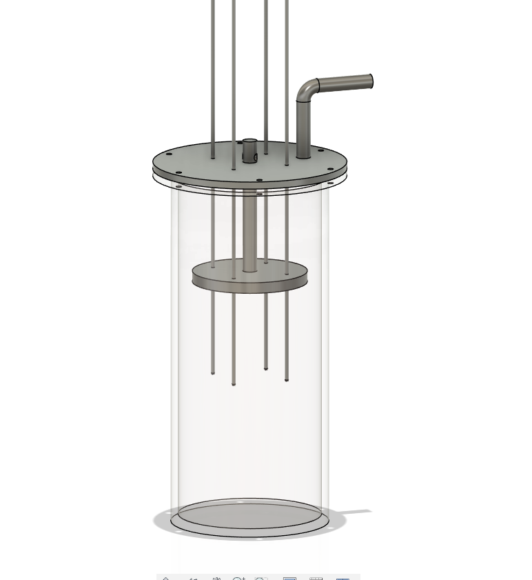
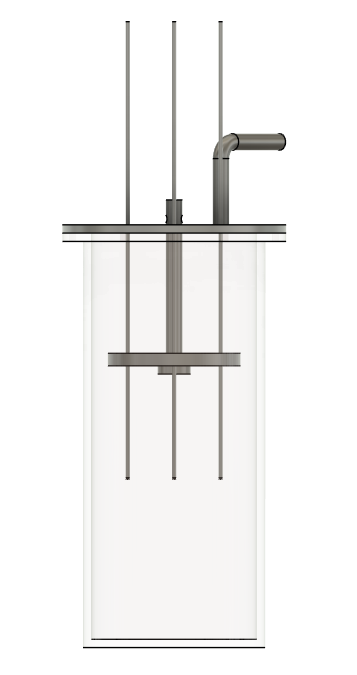

# PIV-for-air-for-Synthetic-Jets
---Project(work in progress in OFFLINE mode)---
Design for PIV (Particle-Image-Velocimetry) for air from Seeding Particle Generator for Synthetic Jets.

## Design of Oil Seeding Generator for Aerosol Jet

  
  

